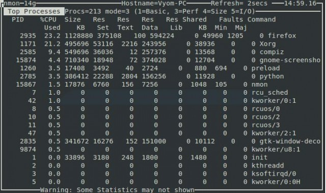
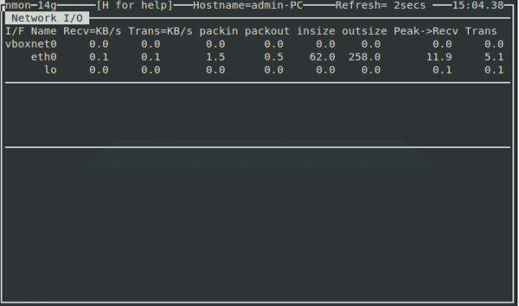
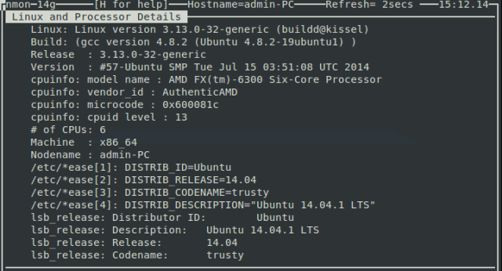

# Installing Nmon

By default nmon is available in the Ubuntu repository. You can easily install nmon by running the following command:  

	yum install  nmon

How to Use Nmon to Monitor Linux Performance  
Once the installation has been finished, you can launch it by typing the nmon command in the terminal.  

	nmon

You wI’ll see the following output:  

You can see from the above screenshot that the nmon command-line utility runs completely in interactive mode, and you can easily toggle statistics using shortcut keys.  
You can use the following nmon keyboard shortcuts to display different system stats:  

    q : to stop and exit Nmon
    h : to see help screen
    c : see CPU stats
    m : see memory stats
    d : see disk stats
    k : see kernel stats
    n : see network stats
    N : see NFS stats
    j : see file system stats
    t : see top process
    V : see virtual memory stats
    v : verbose mode  

# Check CPU by Processor

If you would like to collect some statistics on CPU performance, you should hit the c key on the keyboard.  
After hitting the c key you wI’ll see the following output.  

# Check Top Process Statistics

To get stats on top processes that are running on your system, press the t key on your keyboard.  
You will see the following output.  

# Check Network Statistics  

To get the network stats of your Linux system, just press the n key on your keyboard.  
You wI’ll see the following output:  

# Disk I/O Graphs  

Use the d key to get information about disks.  
You wI’ll see the following output:  

# Check Kernel Information  

A most important key to use with this tool is k; it is used to display some brief information on the kernel of your system.  
You will see the following output after hitting the k key on your keyboard.  

# Get System Information

A very useful key for every system admin is the r key which is used to give information on different resources such as machine architecture, operating system version, Linux version and CPU.  
You will see the following output by hitting the r key.  

还有许多其他的工具做的和 Nmon 同样的工作，不过 Nmon 对一个 Linux 新手来说还是很友好的。
Nmon 监控 Linux 的系统性能

[原文链接]<https://www.maketecheasier.com/monitor-linux-system-performance/>