这篇文章收集了15款最佳的 MySQL 管理工具和应用软件，帮助你轻松快速完成工作。
#Induction

Induction是一款用于理解数据关系的开源管理工具，它可用来探索行/列，运行查询和数据可视化等方面。该工具支持多种数据库，包括   PostgreSQL，MySQL，SQLite，Redis以及MongoDB。此外，Induction还可以通过编写添加其他新的适配器。  
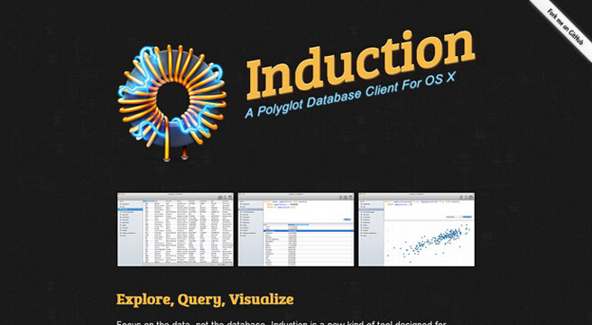  

#Pinba

Pinba 是一种MySQL存储引擎，用于PHP实时监控和数据服务器的MySQL只读接口。它整理并处理通过UDP发送的数据，并以可读的简单报告的形式统计显示多个PHP进程。为了获取下一代更为复杂的报告和统计数据，Pinba提供了原始数据的只读接口。  
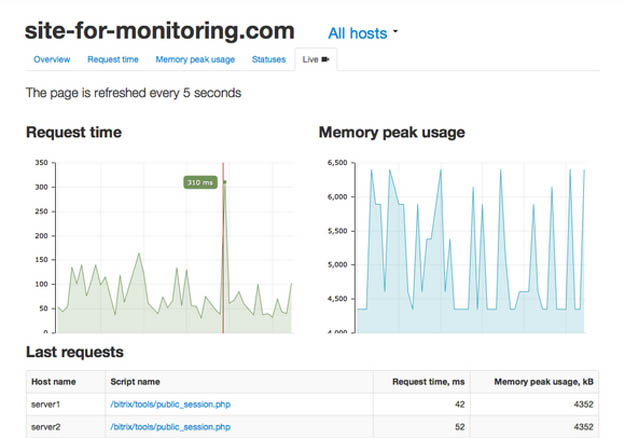  

#DB Ninja

DbNinja是一款先进的基于Web的MySQL数据库管理与开发应用程序。它是远程访问托管服务器的必然之选。DbNinja支持所有最新的功能，包括触发器、事件、视图、存储过程和外键等。此外,它还可以导入和备份数据、MySQL对象结构以及管理用户等。DbNinj的用户界面功能完备且清新美观，可安全地运用于任何浏览器及任何操作系统中。  
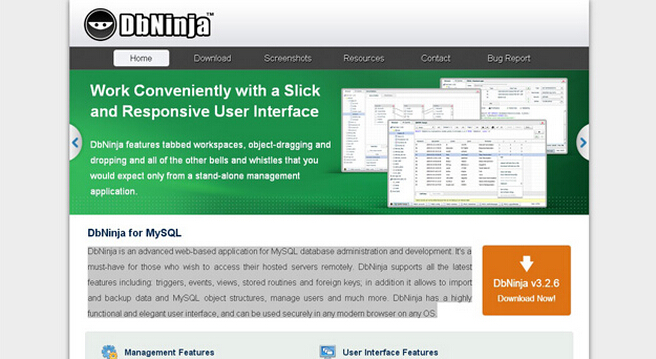  

#DB Tools Manager

DBManager是一款功能强大的数据管理应用程序。作为最先进的应用程序，DBManager内置支持MySQL、PostgreSQL、Interbase/Firebird、 SQLite,DBF表、MSAccess,MSSQL服务器,Sybase,Oracle和ODBC数据库引擎等一些新特性。DBManager目前拥有个人和企业两个版本，用户可按需选择使用。  
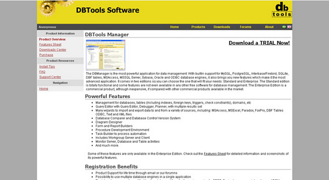  

#Dbeaver

DBeaver是一款免费的数据库管理应用程序，可运用于多种不同的引擎，包括MySQL，MSSQL，Oracle、SQLite、Sybase和Firebird等等。由Java编写而成，该应用程序适用于所有主流操作系统(Windows、Mac和Linux)。它能处理包括元数据编辑(表、列、键、索引)、自定义SQL执行、用户管理、多连接等在内的所有主要任务。  
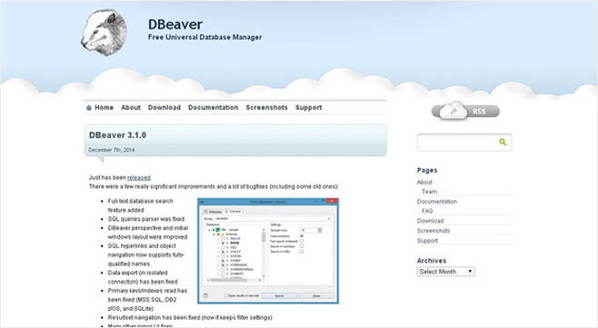  

#SqlWave

SQLWave是一种简单、快速且易用的MySQL客户端。用户可通过该工具轻松地连接到远程主机。SqlWave支持所有MySQL的最新版本，包括它用来管理数据库结构的所有最新功能，如工作表、视图、存储过程、函数、事件、外键和触发器等。  
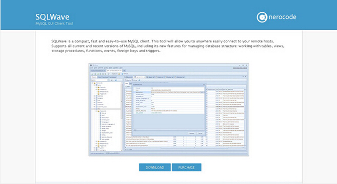  

#MyWebSQL

MyWebSQL主要用于管理基于Web的MySQL数据库。与桌面应用程序的借口工作流程相似，用户无需切换网页即可完成一些简单的操作。如果您正在操作桌面，只用登数据库，就可以管理您的数据库了。  
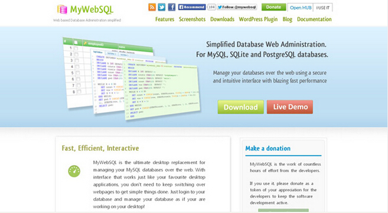  

#Navicat

Navicat是MySQL和MariaDB数据库管理与开发理想的解决方案。它可同时在一个应用程序上连接MySQL和MariaDB数据库。这种兼容前端为数据库提供了一个直观而强大的图形界面管理、开发和维护功能，为初级MySQL和MariaDB开发人员和专业开发人员都提供了一组全面的开发工具。  
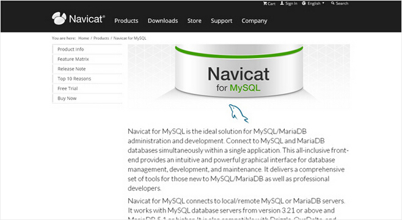  

#SQLyog

SQLyog是一款功能最强大的MySQL管理工具，它综合了MySQL工作台、php MyAdmin和其他MySQL前端及MySQL GUI工具的特点。该款应用程序可以同时连接任意数量级的MySQL服务器，用于测试和生产。所有流程仅需登录MySQL root以收集数据，用户无需安装在MySQL服务器上。  
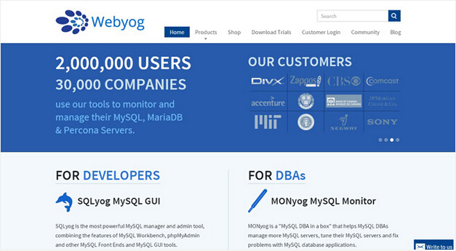  

#Sequel Pro

Sequel Pro是基于MySQL数据库的一种快速易用的Mac数据库管理应用程序。用户可通过Sequel Pro在本地和远程服务器上直接访问MySQL数据库。不过，Sequel Pro的最新版本开始添加全屏支持内置。  
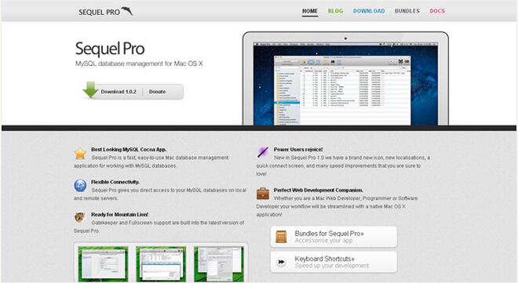  

#HeidiSQL

HeidiSQL是一种专为web开发人员设计的有用且可靠的工具，可用于当前最受欢迎的MySQL服务器，微软SQL数据库和PostgreSQL。该工具可提供浏览和编辑数据、创建和编辑表格、视图、过程、触发器和日志安排等事件。此外，您还可以导出结构和数据至SQL文件、剪贴板或其他服务器。  
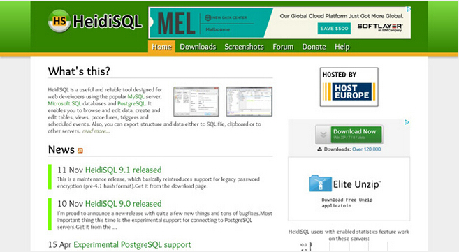  

#MyDB Studio

MyDB Studio是一款免费的MySQL数据库管理器应用程序。该工具强大到您几乎可以获取到任何想要的功能，并能够连接到无限量级的数据库。通过创建、编辑或删除数据库、表格和记录，就可以备份/恢复并导出为多个格式。  
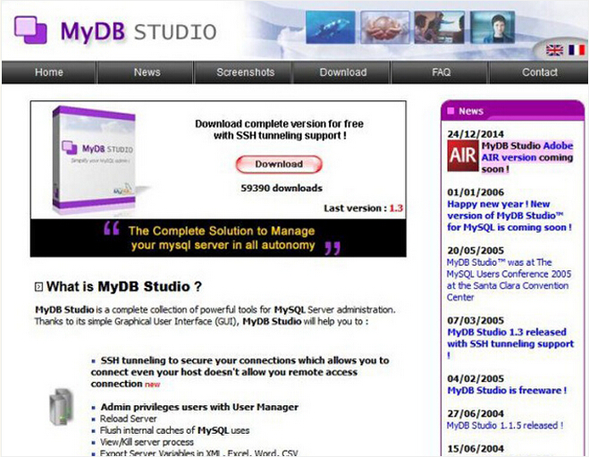  

#SQL Lite Manger

SQL Lite Manager是一款基于web的开源应用程序，用于管理无服务器、零配置SQL Lite数据库。该程序是用PHP写成，除了记录和应用表格格上的每一步操作，还可以控制多个数据库。SQL Lite Manager可用于查询数据，将MySQL查询转化为兼容SQL Lite数据库，并能创建和编辑触发器。SQL Lite Manager有多种皮肤选项，是一个含现成语言文件的多语言资源。  
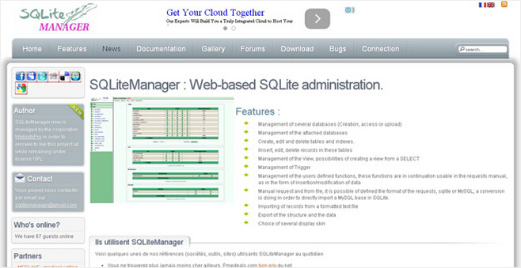  

#Database Master

Database Master是一个现代的、强大的、直观且易用的数据库管理程序。它以一个一致而现代的界面适用于MongoDB、MySQL、PostgreSQL、FireBird、 SQL Lite、MS SQL Server、SQL Azure、Oracle、IBM DB2、IBM Informix、Netezza、Ingres以及EffiProz等数据库。Database Master简化了管理、查询、编辑、可视化、设计和报告数据库系统。用户可以通过ODBC与OleDB连接任何数据库系统，也可以访问MS Access，MS FoxPro Database、Dbase和XML文件。  
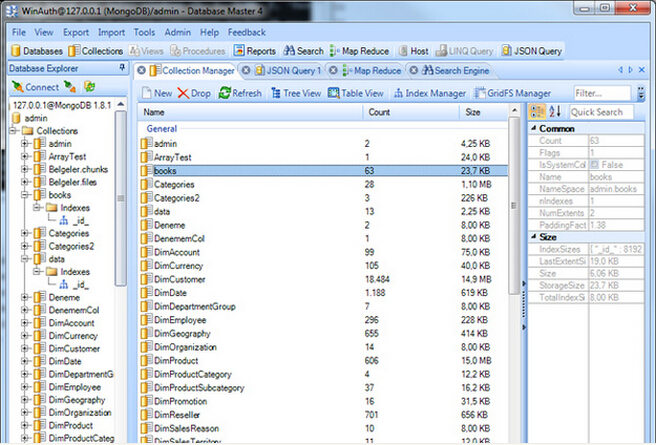  

#Chive

Chive由PHP搭建而成，是一款基于web的开源MySQL管理应用程序。此款应用程式有一个内置的编辑器，当运行复杂的查询或易用的界面时，可用于快速浏览。  
  

[文章源自：]<www.cnblogs.com/lhb25/p/15-best-mysql-management-applications.html>
