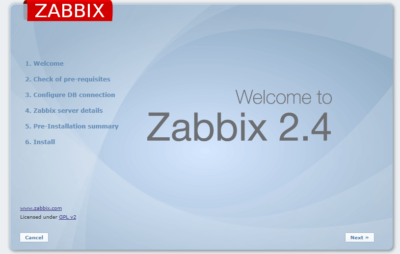
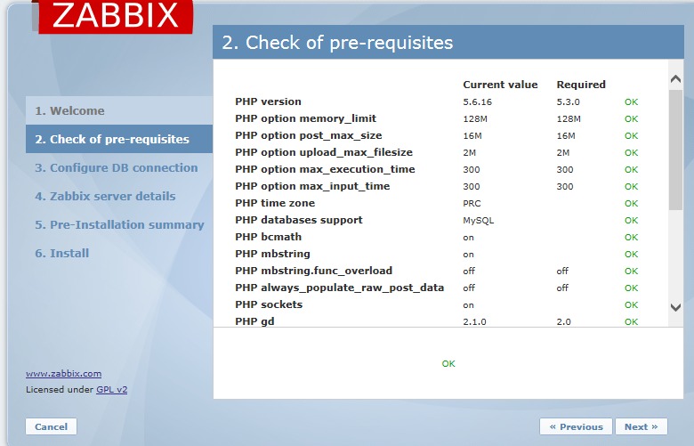
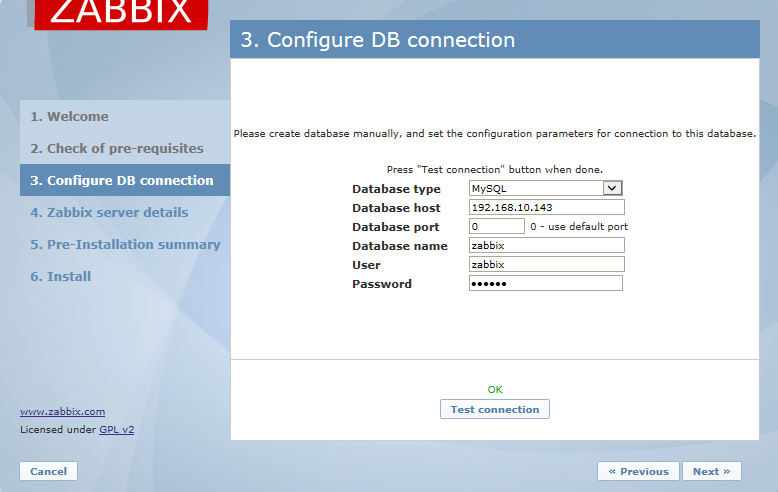
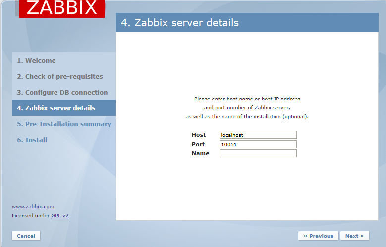
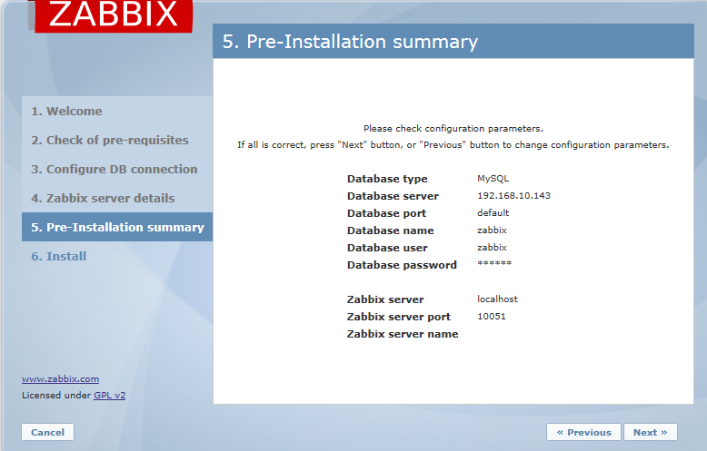
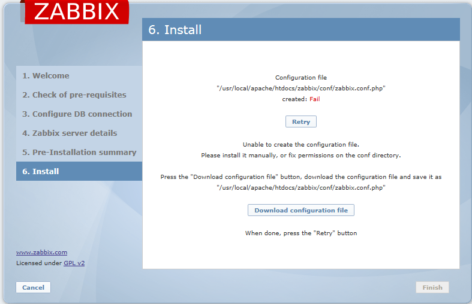
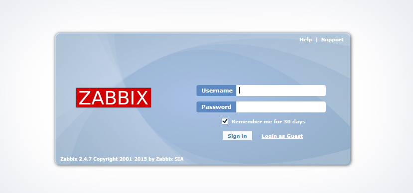

#安装依赖
##安装Perl 、apr / apr-util   

	'''shell 
	yum -y install perl apr apr-util pcre pcre-devel openssl-devel 
	'''

#安装apache server
*apr下载地址*  

	wget http://apache.dataguru.cn//apr/apr-1.5.2.tar.gz

*apr-util下载地址*  

	wget http://apache.dataguru.cn//apr/apr-util-1.5.4.tar.gz

*httpd下载地址*  

	wget http://mirrors.hust.edu.cn/apache//httpd/httpd-2.4.18.tar.gz

##安装apr

    tar -zxvf apr-1.5.2.tar.gz
    cd apr-1.5.2
    ./configure --prefix=/usr/local/apr
    make
    make install

报错：执行configure报错时cannot remove `libtoolT': No such file or directory。  
解决：在configure里面 RM='$RM  -f'   这里的$RM后面一定有一个空格。 如果后面没有空格，直接连接减号，就依
然会报错。把RM='$RM'改为RM='$RM  -f')

##安装apr-util

    tar -zxvf apr-util-1.5.4.tar.gz
    cd apr-util-1.5.4
    ./configure --prefix=/usr/local/apr-util --with-apr=/usr/local/apr 
    make
    make install

##安装httpd

    tar -zxvf httpd-2.4.18.tar.gz  
    cd httpd-2.4.18  
    ./configure --prefix=/usr/local/apache --sysconfdir=/etc/httpd24 --enable-so --enable-ssl --enable-cgi --enable-rewrite --with-zlib --with-pcre --with-apr=/usr/local/apr --with-apr-util=/usr/local/apr-util --enable-modules=most --enable-mpms-shared=all --with-mpm=event
    make
    make install

    --prefix=/usr/local/apache 安装路径
    --sysconfdir=/etc/httpd24 配置文件路径
    --enable-so 允许运行时加载DSO模块
    --enable-ssl 如果不加载将无法使用使用https
    --enable-cgi 允许使用cgi脚本
    --enable-rewrite 支持URL重写机制
    --with-zlib 支持网络通用压缩库
    --with-pcre 支持pcre
    --with-apr=/usr/local/apr 指定apr的安装路径
    --with-apr-util=/usr/local/apr-util/ 指定apr-util的安装路径
    --enable-modules=most 启用大多数常用的模块
    --enable-mpms-shared=all 启用MPM所有支持的模式
    --with-mpm=event 默认使用enevt模式

##配置httpd    

    cp /usr/local/httpd-2.4.18/build/rpm/httpd.init /etc/init.d/httpd  

    vim /etc/init.d/httpd  

      httpd=${HTTPD-/usr/sbin/httpd} 修改成 httpd=${HTTPD-/usr/local/apache/bin/httpd}
      pidfile=${PIDFILE-/var/run/${prog}.pid}  修改成 pidfile=${PIDFILE-/usr/local/apache/logs/${prog}.pid}
      lockfile=${LOCKFILE-/var/lock/subsys/${prog}} 
      RETVAL=0 
      # check for 1.3 configuration 
    check13 () { 
      CONFFILE=/etc/httpd/conf/httpd.conf 修改成CONFFILE=/etc/httpd24/httpd.conf

##启动

	/usr/local/apache/bin/apachectl start

启动时会报错：  
AH00557: httpd: apr_sockaddr_info_get() failed for mysqldb3  
AH00558: httpd: Could not reliably determine the server's fully qualified domain name, using 127.0.0.1. Set the 'ServerName' directive globally to suppress this message
解决：  
可以设定httpd.conf文件中的 ServerName，如下：  
(1)ServerName localhost:80   
vi /etc/httpd24/httpd.conf 加入上面的  
etc/httpd24路径是上面编译的                       
或者在 /etc/hosts 中填入自己的主机名称 mysqldb3，如下：  
(2)127.0.0.1 mysqldb3  

#安装php

    wget http://cn2.php.net/distributions/php-5.6.16.tar.gz

    yum install gcc make gd-devel libjpeg-devel libpng-devel libxml2-devel bzip2-devel libcurl-devel -y 

    tar -zxvf php-5.6.16.tar.gz 
    cd php-5.6.16 
    ./configure  --prefix=/usr/local/php --with-config-file-path=/usr/local/php/etc --with-bz2 --with-curl --with-apxs2=/usr/local/apache/bin/apxs --enable-ftp --enable-sockets --disable-ipv6 --with-gd --with-jpeg-dir=/usr/local --with-png-dir=/usr/local \
    --with-freetype-dir=/usr/local --enable-gd-native-ttf --with-iconv-dir=/usr/local --enable-mbstring --enable-calendar --with-gettext --with-libxml-dir=/usr/local --with-zlib --with-pdo-mysql=mysqlnd --with-mysqli=mysqlnd --with-mysql=mysqlnd --enable-dom --enable-xml --enable-fpm --with-libdir=lib64 --enable-bcmath 
    make
    make install

解压后的目录下复制php.ini-production

    cp /usr/local/php-5.6.16/php.ini-production /usr/local/php/etc/php.ini
    vi /usr/local/php/etc/php.ini
    修改
    max_execution_time = 300 
    memory_limit = 128M 
    post_max_size = 16M 
    upload_max_filesize = 2M
    max_input_time = 300 
    date.timezone = PRC
    always_populate_raw_post_data = -1

#mysql源码安装见我其他源码安装文档

#安装zabbix
##zabbix server软件安装

    zabbix server下载地址：
    wget http://netix.dl.sourceforge.net/project/zabbix/ZABBIX%20Latest%20Stable/2.4.7/zabbix-2.4.7.tar.gz
    zabbix agent下载地址：
    wget http://www.zabbix.com/downloads/2.4.6/zabbix_agents_2.4.6.linux.ppc64le.tar.gz
    
    groupadd zabbix
    useradd zabbix -g zabbix
    
    yum install -y net-snmp-devel 
    yum install -y perl-DBI
    tar -zxvf zabbix-2.4.7.tar.gz
    cd zabbix-2.4.7
    ./configure --prefix=/usr/local/zabbix/  --enable-server --enable-agent --with-mysql --with-net-snmp --with-libcurl --with-libxml2 -enable-proxy
    make
    make install

##配置mysql

    create database zabbix character set utf8;   
    grant all privileges on *.* to zabbix@'localhost' identified by 'zabbix';  
    grant all privileges on *.* to zabbix@'%' identified by 'zabbix'; 
    flush privileges;

##导入表结构 

    mysql -uroot -p zabbix< /usr/local/zabbix-2.4.7/database/mysql/schema.sql 
    mysql -uroot -p zabbix</usr/local/zabbix-2.4.7/database/mysql/images.sql 
    mysql -uroot -p zabbix< /usr/local/zabbix-2.4.7/database/mysql/data.sql 

##修改zabbix配置

    vim /usr/local/zabbix/etc/zabbix_server.conf
    LogFile=/tmp/zabbix_server.log ##日志位置，根据需求修改；
    PidFile=/tmp/zabbix_server.pid ##PID 所在位置
    DBHost=localhost ##如果不是在本机，请修改
    DBName=zabbix ##数据库名称
    DBUser=zabbix ##数据库用户名
    DBPassword=zabbix ##数据库密码

启动zabbix server时报错：
/home/user/zabbix-2.4.7/sbin/zabbix_server: error while loading shared libraries: libmysqlclient.so.18: cannot open shared object file: No such file or directory  
解决：
ln -s /usr/local/mysql/lib/libmysqlclient.so.18 /usr/lib64 

##启动zabbix

	/usr/local/zabbix/sbin/zabbix_server

##添加Zabbix的PHP文件到Apache

    cp -rf /usr/local/zabbix-2.4.7/frontends/php/  /usr/local/apache/htdocs/
    cd /usr/local/apache/htdocs/
    mv php zabbix  

##重启Apache server 

	/usr/local/apache/bin/apachectl restart 

##配置Apache使其支持PHP 

配置文件：/etc/httpd24/httpd.conf    
操作：  

    vi /etc/httpd24/httpd.conf 
    修改DirectoryIndex为DirectoryIndex  index.html  index.php 
    添加AddType application/x-httpd-php .php (.的前面有个空格）
    添加LoadModule php5_module modules/libphp5.so （可不加）

##配置zabbix可以监控自己
修改agent配置文件，设置zabbix服务器地址  

vim /usr/local/zabbix/etc/zabbix_agentd.conf
Server=192.168.10.143  #设置zabbix服务器端地址 
ServerActive=192.168.10.143  #主动发起请求给服务器端，服务器端的地址  
Hostname=mysqldb3  #主动联系zabbix服务器时，告诉服务器的主机名，需全局唯一

##启动客户端

	/usr/local/zabbix/sbin/zabbix_agent

web界面设置，在configuration--> hosts 中，点击disabled即可启用对本机的监控

#然后登陆网页进行配置

浏览器输入ip/zabbix

next

next输入相关测试

直接next

直接next

下载文件到相应的目录就结束了

用户名admin 密码zabbix

# linux之zabbix-agent安装
##与server区别就是编译时参数只启动代理

    wget http://netix.dl.sourceforge.net/project/zabbix/ZABBIX%20Latest%20Stable/2.4.7/zabbix-2.4.7.tar.gz
    yum install -y net-snmp-devel 
    yum install -y perl-DBI
    tar -zxvf zabbix-2.4.7.tar.gz
    cd zabbix-2.4.7
    ./configure --prefix=/usr/local/zabbix/  --enable-agent 
    make
    make install

##修改agent配置文件，设置zabbix服务器地址

vim /usr/local/zabbix/etc/zabbix_agentd.conf
Server=192.168.10.143  #设置zabbix服务器端地址 
ServerActive=192.168.10.143#主动发起请求给服务器端，服务器端的地址  
Hostname=mysqldb1#主动联系zabbix服务器时，告诉服务器的主机名，需全局唯一

##启动客户端

	/usr/local/zabbix/sbin/zabbix_agentd（有d）

web界面设置，在configuration--> hosts 中，点击disabled即可启用对本机的监控

# windows之zabbix-agent安装
##安装agent
在windows控制台下执行以下命令：  

	E:\zabbix\bin\win32\zabbix_agentd.exe  -c E:\zabbix\conf\zabbix_agentd.win.conf –i 
##启动agent客户端
启动命令如下：  

	E:\zabbix\bin\win32\zabbix_agentd.exe  -c E:\zabbix\conf\zabbix_agentd.win.conf –s 

#zabbix 中文乱码

在windows的C:\Windows\Fonts目录下找到楷体 常规字体（simkai.ttf）上传到/usr/local/apache/htdocs/zabbix/fonts/目录下
然后修改/usr/local/apache/htdocs/zabbix/include/defines.inc.php文件
define('ZBX_GRAPH_FONT_NAME',         'DejaVuSans');改为define('ZBX_GRAPH_FONT_NAME',         'simkai');
define('ZBX_FONT_NAME', 'DejaVuSans'); 改为define('ZBX_FONT_NAME', 'simkai');