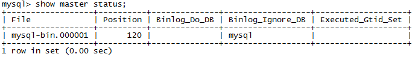
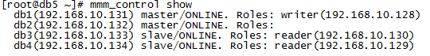
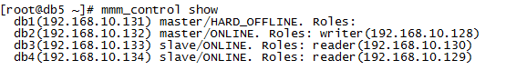

# 实现原理
两台master互为主从，一台为只读，做为备份，应急时可做为写master.其中mmm_mond进程定时心跳检测，失败则将write ip 浮动到另外一台master。

# MySQL-MMM优缺点

1.  优点：高可用性，扩展性好，出现故障自动切换，对于主主同步，在同一时间只提供一台数据库写操作。
2.  缺点：Monitor节点是单点，可以结合Keepalived实现高可用
3.  由于MMM无法完全的保证数据一致性，所以MMM适用于对数据的一致性要求不是很高，但是又想最大程度的保证业务可用性的场景。对于那些对数据的一致性要求很高的业务，非常不建议采用MMM这种高可用架构。

# 安装mysql软件

在每台服务器上安装mysql软件，安装参照《linux 6 源码安装mysql5.6》
在每台服务器上关闭selinux，关闭防火墙
在配置文件my.cnf里增加如下内容:

    [mysqld]
    datadir=/usr/local/mysql/data
    socket=/var/lib/mysql/mysql.sock
    user=mysql
     
    #下面为新添加的内容
    default-storage-engine = innodb
     
    replicate-ignore-db = mysql
    binlog-ignore-db= mysql
     
    server-id   = 1
    log-bin = /usr/local/mysql/logs/mysql-bin.log
    log_bin_index   = /usr/local/mysql/logs/mysql-bin.log.index
    relay_log   = /usr/local/mysql/logs/mysql-bin.relay
    relay_log_index = /usr/local/mysql/logs/mysql-bin.relay.index
    expire_logs_days= 10
    max_binlog_size = 100M
    log_slave_updates 
    sync-binlog = 1 

# 在/etc/hosts里配上所有主机信息

    192.168.10.131 db1
    192.168.10.132 db2
    192.168.10.133 db3
    192.168.10.134 db4
    192.168.10.135 db5

# 配置主主复制

即两个主master（db1、db2）互为主从，与主从类似，只是需要逆向配置一下。  
a、先查看db1 db2 binlog日志和pos值  
db1  
  
db2  

b、在db1执行：  

    mysql> GRANT REPLICATION SLAVE ON *.* TO 'replication'@'192.168.10.%' IDENTIFIED BY 'replication';
    mysql> flush privileges;
    mysql> change master to master_host='192.168.10.132', master_user='replication',master_password='replication', master_log_file='mysql-bin.000003',master_log_pos=120; 
    mysql> start slave; #启动同步  

c、在db2执行：  

    mysql> GRANT REPLICATION SLAVE ON *.* TO 'replication'@'192.168.10.%' IDENTIFIED BY 'replication';
    mysql> flush privileges;
    mysql> change master to master_host='192.168.10.131', master_user='replication',master_password='replication', master_log_file='mysql-bin.000001',master_log_pos=120; 
    mysql> start slave; #启动同步

# db3、db4作为db1的从库slave  
在db3、db4上执行  

    mysql> change master to master_host='192.168.10.131', master_user='replication',master_password='replication', master_log_file='mysql-bin.000001',master_log_pos=120; 
    mysql> start slave; #启动同步

# MYSQL-MMM的安装  
（1）epel源安装  
CentOS 默认没有 mysql-mmm 软件包，官方推荐使用 epel 的网络源，五台都安装epel：  

    wget http://mirrors.hustunique.com/epel/6/x86_64/epel-release-6-8.noarch.rpm   
    wget http://mirrors.hustunique.com/epel/RPM-GPG-KEY-EPEL-6   
    rpm --import RPM-GPG-KEY-EPEL-6  
    rpm -ivh epel-release-6-8.noarch.rpm 

（2）monitor节点安装db5  
在db5上执行  

    yum -y install mysql-mmm-monitor  

（3）四台db节点上安装agent  
在db1 db2 db3 db4上执行  

    yum -y install mysql-mmm-agent

（4）四台db节点上授权monitor访问  
在db1 db2 db3 db4执行  

	mysql -uroot -p
	mysql> GRANT REPLICATION CLIENT ON *.* TO 'mmm_monitor'@'192.168.10.%' IDENTIFIED BY 'monitor';                  
	mysql> GRANT SUPER,REPLICATION CLIENT, PROCESS ON *.* TO 'mmm_agent'@'192.168.10.%' IDENTIFIED BY'agent';  

（5）在db1上修改mmm_common.conf文件（5台相同）  

    vi /etc/mysql-mmm/mmm_common.conf
    
    active_master_role  writer
    <host default>
    cluster_interface   eth0
    pid_path/var/run/mysql-mmm/mmm_agentd.pid
    bin_path/usr/libexec/mysql-mmm/
    replication_userreplication
    replication_passwordreplication
    agent_user  mmm_agent
    agent_password  agent
    </host>
    
    <host db1>
    ip  192.168.10.131
    modemaster
    peerdb2
    </host>
    
    <host db2>
    ip  192.168.10.132
    modemaster
    peerdb1
    </host>
    
    <host db3>
    ip  192.168.10.133
    modeslave
    </host>
    
    <host db4>
    ip  192.168.10.134
    modeslave
    </host>
    
    <role writer>
    hosts   db1, db2
    ips 192.168.10.128
    modeexclusive #只有一个虚拟IP可以写
    </role>
    
    <role reader>
    hosts   db3, db4
    ips 192.168.10.129, 192.168.10.130
    modebalanced #多个虚拟ip可以读
    </role>

传到其它4个节点  

	scp /etc/mysql-mmm/mmm_common.conf root@192.168.10.132:/etc/mysql-mmm/
	scp /etc/mysql-mmm/mmm_common.conf root@192.168.10.133:/etc/mysql-mmm/
	scp /etc/mysql-mmm/mmm_common.conf root@192.168.10.134:/etc/mysql-mmm/
	scp /etc/mysql-mmm/mmm_common.conf root@192.168.10.135:/etc/mysql-mmm/  

若无scp命令，安装一下包  

	yum install openssh-clients

（6）修改四台db代理端 mmm_agent.conf 文件  
在db1 db2 db3 db4上修改  

    vi /etc/mysql-mmm/mmm_agent.conf
    include mmm_common.conf
    this db1   #分别修改为本机的主机名，即db1、db2、db3和db4

（7）修改管理端的mmm_mon.conf文件  
在db5上执行  

    vi /etc/mysql-mmm/mmm_mon.conf
    
    include mmm_common.conf
    <monitor>
    ip  127.0.0.1
    pid_path/var/run/mysql-mmm/mmm_mond.pid
    bin_path/usr/libexec/mysql-mmm
    status_path /var/lib/mysql-mmm/mmm_mond.status
    ping_ips192.168.10.131,192.168.10.132,192.168.10.133,192.168.10.133,192.168.10.134 #真实数据库IP，来检测网络是否正常
    auto_set_online 10  #恢复后自动设置在线的时间
    </monitor>
    <host default>
    monitor_usermmm_monitor
    monitor_passwordmonitor
    </host>
    debug 0

# 启动MYSQL-MMM  

（1）db代理端启动db1 db2 db3 db4  

    [root@db1 ~]# /etc/init.d/mysql-mmm-agent start
    [root@db1 ~]# chkconfig mysql-mmm-agent on

（2）monitor管理端启动 db5  

    [root@db5 ~]# /etc/init.d/mysql-mmm-monitor start
    [root@db5 ~]# chkconfig mysql-mmm-monitor on

# 测试集群
（1）查看集群状态db5  
mmm_control show  

（2）故障转移  
模拟停掉db1数据库后  

看它的状态变了
